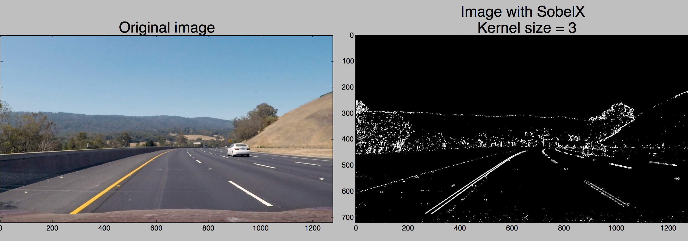
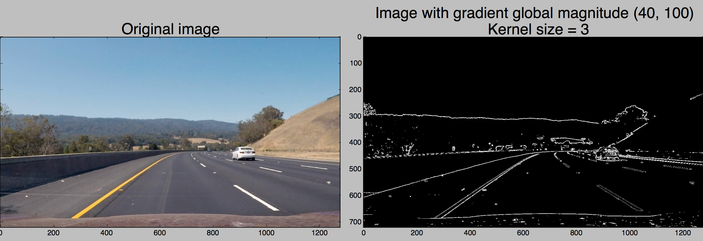
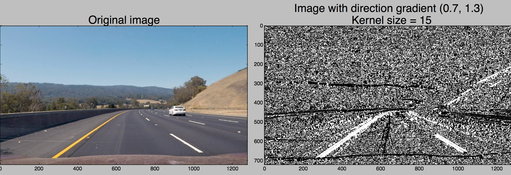
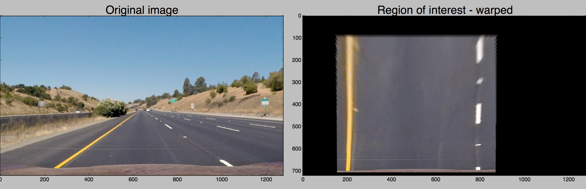
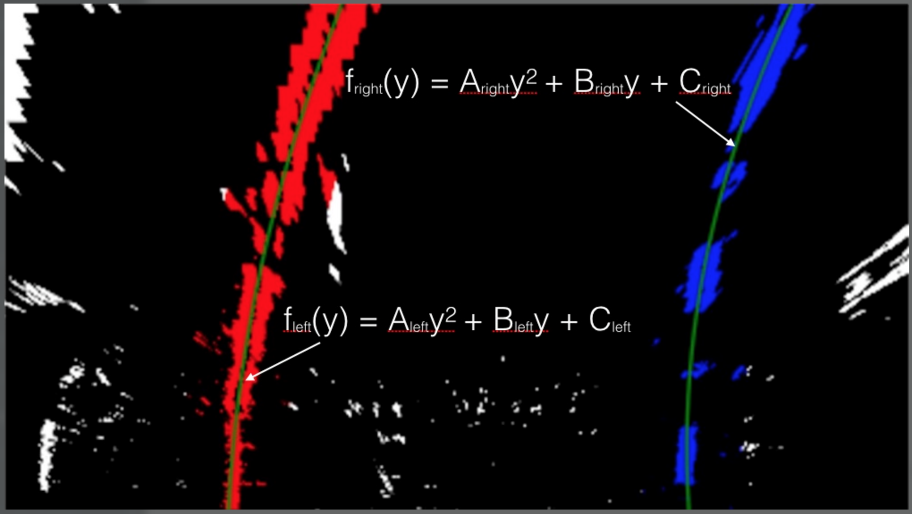
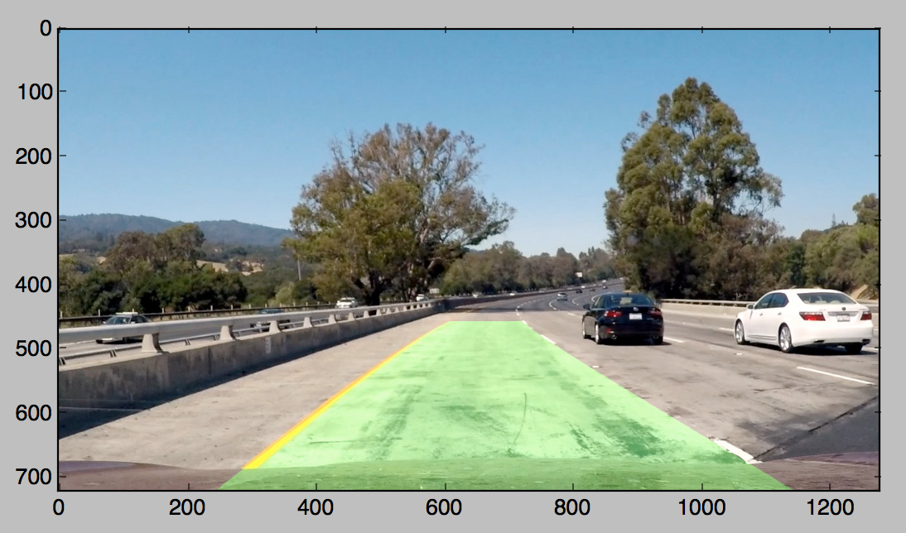

# Self-Driving Car Engineer Nanodegree
# Computer vision 
## Project: Advanced lines finding

### Overview
This is the 4th project of the <a href="https://www.udacity.com/course/self-driving-car-engineer-nanodegree--nd013">Self Driving Car Engineer Nanodegree</a> I am taking part.  
The aim of this project was to use different computer vision technique to clearly identify road lane lines from a video. 
Most of the work has been done using OpenCV as well as Numpy. 

### Pipeline

The first things to do is to compute the camera calibration matrix and distortion coefficients given a set of chessboard images.
Indeed, the camera image is deformed because the inner conception in the camera. For example, the further the bacground is, the more 2 parallel lines will look like they have been merged in one point.  
The camera calibration step allows me to correct this distortion. I used chessboard images to calibrate the cameras, since the corners are clearly defined. 

For each image of the video, the following steps have been applied (in this order):

* Apply a distortion correction to raw images.
* Use color transforms, gradients, etc., to create a thresholded binary image.
* Apply a perspective transform to rectify binary image ("birds-eye view").
* Detect lane pixels and fit to find the lane boundary.
* Determine the curvature of the lane and vehicle position with respect to center.
* Warp the detected lane boundaries back onto the original image.
* Output visual display of the lane boundaries and numerical estimation of lane curvature and vehicle position.

### Step details 

* Apply a distortion correction to raw images.
This allow to un-distort the original image. Applied to a chessboard image, the result can be seen below.

* Use color transforms, gradients, etc., to create a thresholded binary image.
I have used a combination of differents masks and space color transformation to make the lines as visible as possible.  
I first combined the result from a SobelX and SobelY mask to the original undistorted image: 

Then, I applied a threshold to the overall magnitude of the gradient, in x and y directions.

I then applied a direction gradient of the Y direction of the image (because the lines are mostly vertical in the image) 

Finally I transormed the image into HSV space and combine them with all the steps above, to obtain the following final result: 

* Apply a perspective transform to rectify binary image ("birds-eye view").
I applied a mask to only keep a defined region of interest. There is indeed no need to keep the whole image to find the lines. 

In order to best calculate the curvature of the line, I needed to change the perspective of the image. A "bird-eye" view has been adopted, which allow me to see the lines on a 2D plane. 

* Detect lane pixels and fit to find the lane boundary.
For this step, the image has been horizontally sliced in 10 different parts, with the same height.  

Each sliced is then divided verticaly - to isolate the right line from the left one. 
I then add all the white pixels together, in order to find the X position where there is the highest density of pixel. This way, I can clearly identify the position of the lane, based on the density of the pixels from the binary image. Here the peaks indicate the X-position of the line. 

Which, applied on the whole image give the following result: 
 

* Determine the curvature of the lane and vehicle position with respect to center.
A second degre polynomial is computed to fit the line curvature. 
 

* Warp the detected lane boundaries back onto the original image.
The detected line section is finally drawn onto the original image.
 