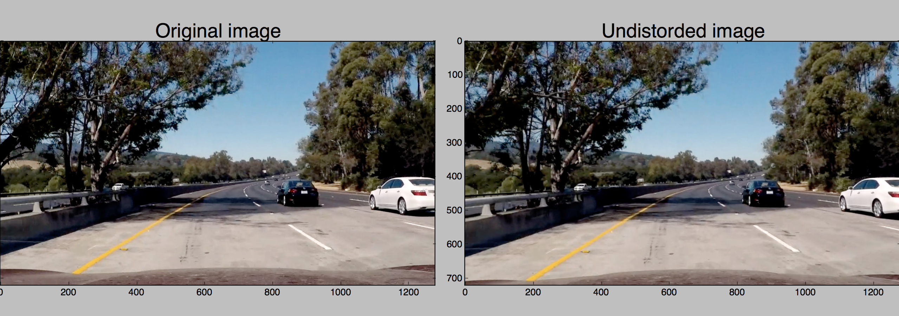
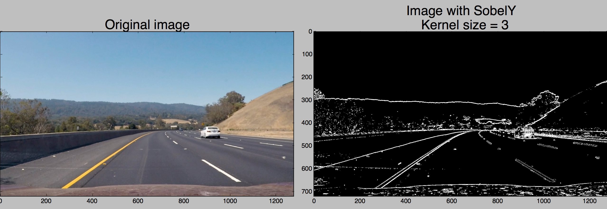
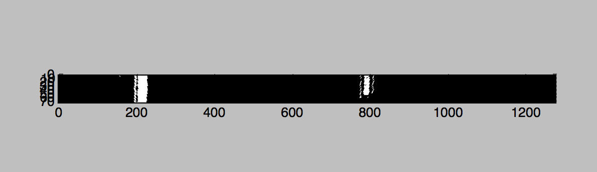
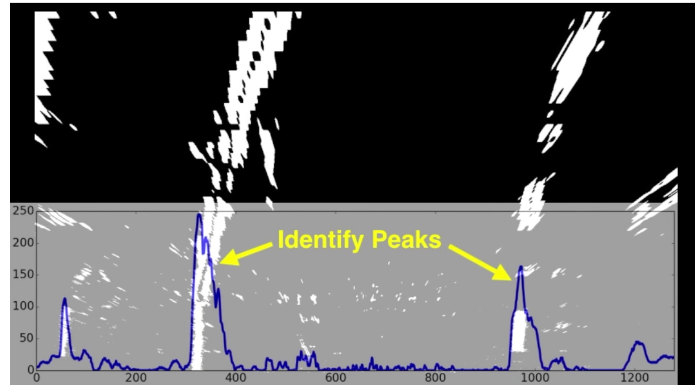
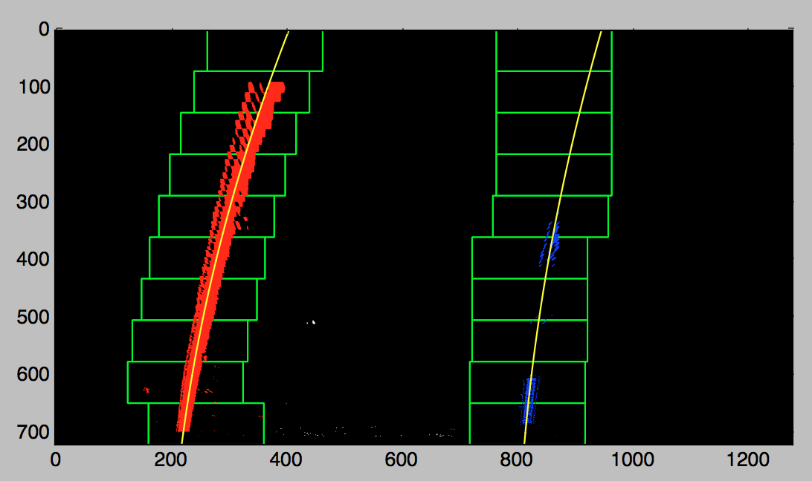
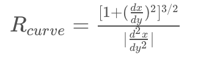
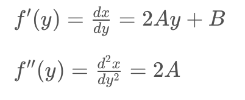
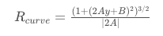

##Writeup Template

**Advanced Lane Finding Project**

###Each points from the requirements rubric are here described

---
###Writeup / README

####1. Provide a Writeup / README that includes all the rubric points and how you addressed each one.  You can submit your writeup as markdown or pdf.
See the [README.md](https://github.com/Mornor/CarND-Advanced-Lane-Lines/blob/master/README.md) file in this project. 

###Camera Calibration

####1. Briefly state how you computed the camera matrix and distortion coefficients. Provide an example of a distortion corrected calibration image.

I start by preparing "object points", which will be the (x, y, z) coordinates of the chessboard corners in the world. Here I am assuming the chessboard is fixed on the (x, y) plane at z=0, such that the object points are the same for each calibration image.  Thus, `objp` is just a replicated array of coordinates, and `objpoints` will be appended with a copy of it every time I successfully detect all chessboard corners in a test image.  `imgpoints` will be appended with the (x, y) pixel position of each of the corners in the image plane with each successful chessboard detection.  

I then used the output `objpoints` and `imgpoints` to compute the camera calibration and distortion coefficients using the `cv2.calibrateCamera()` function.  I applied this distortion correction to the test image using the `cv2.undistort()` function and obtained this result: 


###Pipeline (single images)

####1. Provide an example of a distortion-corrected image.
The `objpoints` and `imgpoints` calculated when calibrating the camera are then used to undistort each image, with the help of the 
`undistort` function provided by OpenCV: 


####2. Describe how (and identify where in your code) you used color transforms, gradients or other methods to create a thresholded binary image.  Provide an example of a binary image result.
I have used a combination of differents masks and space color transformation to make the lines as visible as possible. <br>
I first combined the result from a SobelX and SobelY mask to the original undistorted image: 


Then, I applied a threshold to the overall magnitude of the gradient, in x and y directions.

I then applied a direction gradient of the Y direction of the image (because the lines are mostly vertical in the image) 

Finally I transormed the image into HSV space and combine them with all the steps above, to obtain the following final result: 


####3. Describe how (and identify where in your code) you performed a perspective transform and provide an example of a transformed image.

The code for my perspective transform includes a function called `warp()`, which start at lines 221 in the file `./src/utils.py`.  The `warp()` function takes only an input image (`image`). The source (`src`) and destination (`dst`) points are harcoded as the following manner: 

```
src = np.float32([
	 [765, 460],   
	 [1180, 720], 
	 [180, 720],  
	 [575, 460] 	
])  	

dst = np.float32([
	 [960, 0],    	
	 [960, 720], 
	 [320, 720],  
	 [320, 0]  	
])

```
I verified that my perspective transform was working as expected by drawing the `src` and `dst` points onto a test image and its warped counterpart to verify that the lines appear parallel in the warped image.


####4. Describe how (and identify where in your code) you identified lane-line pixels and fit their positions with a polynomial?

The `get_polynomials_curve()` in `./src/utils.py`, line 89 only take an image and do the following actions to find the polynomials fitting to the line curve. 
The image is sliced in 10 different horizontal parts, with the same height. <br>

Each sliced is then divided verticaly - to isolate the right line from the left one. 
I then add all the white pixels together, in order to find the X position where there is the highest density of pixel. This way, I can clearly identify the position of the lane, based on the density of the pixels from the binary image. Here the peaks indicate the X-position of the line. 

Which, applied on the whole image give the following result: 


####5. Describe how (and identify where in your code) you calculated the radius of curvature of the lane and the position of the vehicle with respect to center.

I did this in `get_line_curvature()` method (line 41 of `./src/utils.py`). This function take an `image` as well as the left and right polynomials fitting the detected lines (`left_fit` and `right_fit` respectively). <br>
The Radius of curvature is given by the following formula: 

Then, I take the derivatives of the polynomials: 

Which gives: 

I then convert it in meters. 

####6. Provide an example image of your result plotted back down onto the road such that the lane area is identified clearly.

I implemented this step in lines # through # in my code in `yet_another_file.py` in the function `map_lane()`.  Here is an example of my result on a test image:

 

---

###Pipeline (video)

####1. Provide a link to your final video output.  Your pipeline should perform reasonably well on the entire project video (wobbly lines are ok but no catastrophic failures that would cause the car to drive off the road!).

Here's a [the final result](./output.mp4)

---

###Discussion

####1. Briefly discuss any problems / issues you faced in your implementation of this project.  Where will your pipeline likely fail?  What could you do to make it more robust?

Here I'll talk about the approach I took, what techniques I used, what worked and why, where the pipeline might fail and how I might improve it if I were going to pursue this project further.  

